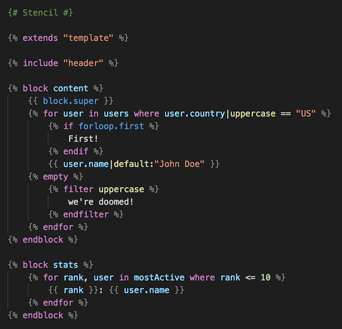
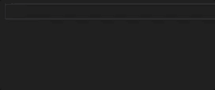
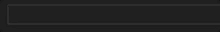
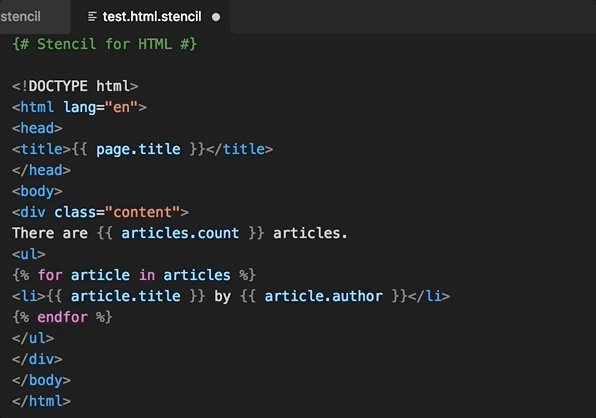

# Stencil for Visual Studio Code

This extension adds support for the [Stencil](https://stencil.fuller.li) template language.

## Features

### Syntax highlighting

This extension includes a [TextMate grammar](https://github.com/stencilproject/stencil.tmbundle) wirtten specifically for Stencil. This should allow for the best possible syntax highlighting:



Also included is a **Stencil for HTML** language that supports both Stencil and HTML:


### Snippets

Snippets are included for all common tags:

- **block**: a `block` tag.
- **extends**: an `extends` tag.
- **filter**: a `filter` tag.
- **for**: a `for` tag to iterate over an array.
- **forempty**: a `for` tag to iterate over an array that includes an `empty` tag.
- **fordict**: a `for` tag to iterate over a dictionary.
- **fordictempty**: a `for` tag to iterate over a dictionary that includes an `empty` tag.
- **if**: an `if` tag.
- **ifelse**: an `if` tag that includes an `else` tag.
- **ifif**: an `if` tag that includes an `elif` tag.
- **ififelse**: an `if` tag that includes both an `elif` tag and an `else` tag.
- **include**: an `include` tag.

Snippets include tab stops so you can easily move around:



Autoclosing pairs are set up for `{{`, `{%` and `{#` so you can easily type variables, tags and comments:



You can also use the **Toggle Comment** keyboard shortcut to create comments.
This will generate a `{# #}` comment in Stencil templates and a `<!-- -->` comment in Stencil for HTML templates.

### Indentation

Indentation rules are included for both Stencil and Stencil for HTML. Thanks to these rules, Visual Studio Code will suggest the proper indentation.

This makes moving lines around a lot easier:


Even better, the **Reindent Lines** command will just work:



## Configuration

This extension is set up to use the following file extensions:

- `.stencil`: Stencil templates.
- `.html.stencil`: Stencil for HTML templates.

If you use Stencil exclusively for HTML and would like to use the `.stencil` extension for Stencil for HTML instead, add the following to your Visual Studio Code preferences:

```
"files.associations": {
    "*.stencil": "stencil-html"
}
```

## Known Issues

Mixed grammars are not without issues and neither is Stencil for HTML. Because of the way grammars are embedded, Stencil will not be supported in embedded CSS or JavaScript. The template will work fine, but syntax highlighting and indentation will be off. I am looking into ways to improve this, but a perfect solution may not be possible.
